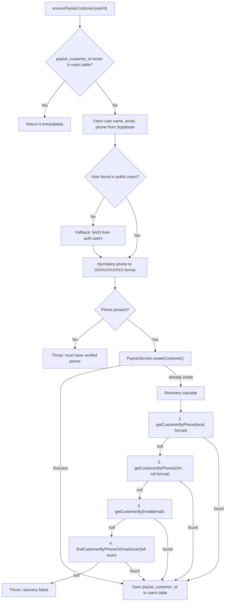
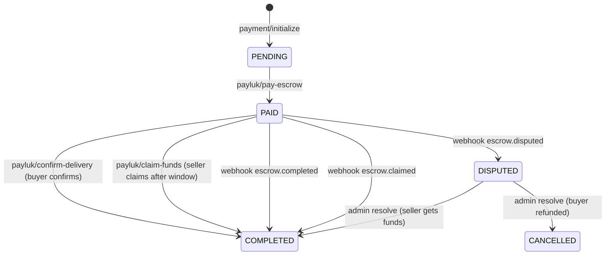
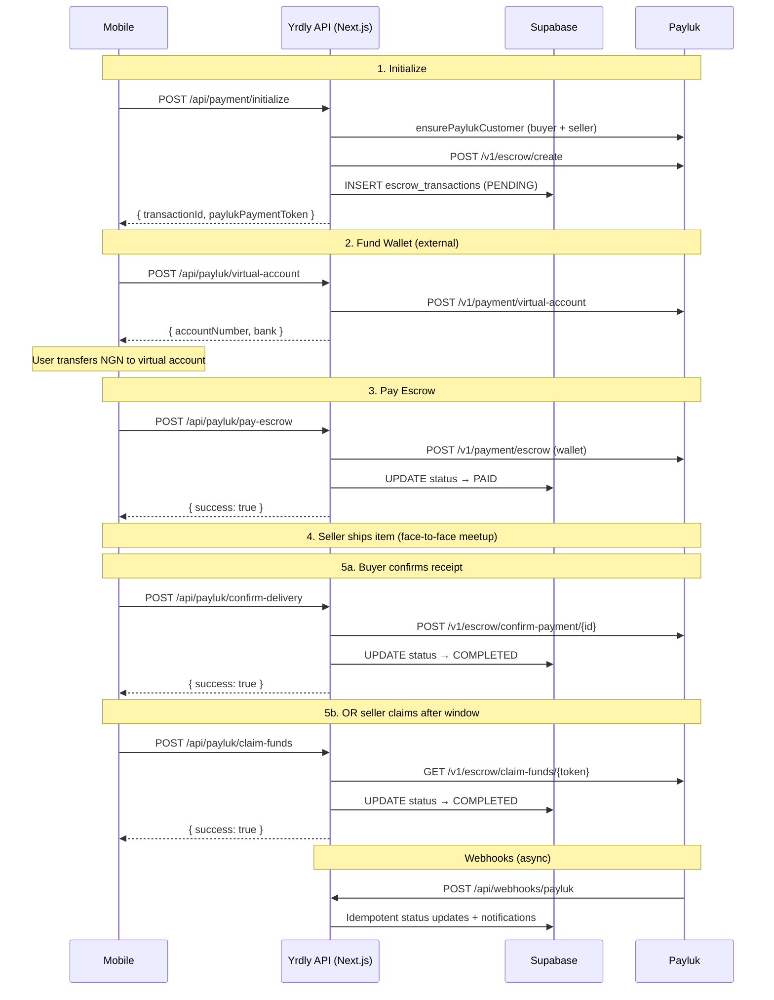

# Payluk Integration — yrdly-app

> Complete technical reference for how Yrdly integrates with Payluk as its escrow payment provider.

---

## Architecture Overview

Payluk is Yrdly's escrow payment provider. It holds buyer funds in escrow until the buyer confirms receipt of the item, then releases funds to the seller. Yrdly is registered as a **merchant** on Payluk; every Yrdly user becomes a **customer** under that merchant account.

### Core Files

| File | Purpose |
|------|---------|
| [payluk-service.ts](file:///Users/macbook/Development/projects/yrdly-app/src/lib/payluk-service.ts) | Low-level API wrapper — all Payluk HTTP calls go through here |
| [payluk-onboarding.ts](file:///Users/macbook/Development/projects/yrdly-app/src/lib/payluk-onboarding.ts) | `ensurePaylukCustomer()` — creates or recovers Payluk customer IDs |
| [payment/initialize/route.ts](file:///Users/macbook/Development/projects/yrdly-app/src/app/api/payment/initialize/route.ts) | Creates escrow + local transaction row |
| [payluk/pay-escrow/route.ts](file:///Users/macbook/Development/projects/yrdly-app/src/app/api/payluk/pay-escrow/route.ts) | Buyer funds the escrow from wallet |
| [payluk/confirm-delivery/route.ts](file:///Users/macbook/Development/projects/yrdly-app/src/app/api/payluk/confirm-delivery/route.ts) | Buyer confirms receipt → releases funds to seller |
| [payluk/claim-funds/route.ts](file:///Users/macbook/Development/projects/yrdly-app/src/app/api/payluk/claim-funds/route.ts) | Seller claims funds after delivery window elapses |
| [payluk/virtual-account/route.ts](file:///Users/macbook/Development/projects/yrdly-app/src/app/api/payluk/virtual-account/route.ts) | Generates virtual bank account for wallet top-up |
| [payluk/wallet-balance/route.ts](file:///Users/macbook/Development/projects/yrdly-app/src/app/api/payluk/wallet-balance/route.ts) | Returns user's Payluk wallet balance |
| [webhooks/payluk/route.ts](file:///Users/macbook/Development/projects/yrdly-app/src/app/api/webhooks/payluk/route.ts) | Receives Payluk webhook events |
| [admin/disputes/[disputeId]/resolve/route.ts](file:///Users/macbook/Development/projects/yrdly-app/src/app/api/admin/disputes/%5BdisputeId%5D/resolve/route.ts) | Admin resolves disputes via Payluk |
| [escrow.ts](file:///Users/macbook/Development/projects/yrdly-app/src/types/escrow.ts) | TypeScript enums and interfaces for escrow domain |

### Environment Configuration

| Variable | Description |
|----------|-------------|
| `PAYLUK_SECRET_KEY` | Merchant API key (`sk_test_...` for staging, `sk_live_...` for production) |
| `PAYLUK_BASE_URL` | API base URL. Defaults to `https://staging.api.payluk.ng` if unset |

> [!IMPORTANT]
> `payluk-service.ts` is **server-side only**. It must never be imported in client components — the secret key would be exposed.

---

## Authentication Model

All Payluk API calls carry two auth tokens:

1. **`Authorization: Bearer {PAYLUK_SECRET_KEY}`** — identifies the Yrdly merchant account
2. **`customer-id: {paylukCustomerId}`** — identifies which customer is acting (buyer or seller)

Some routes are merchant-only (e.g. dispute resolution) and must **not** send `customer-id`.

### Request Helpers

Two internal functions handle all HTTP calls:

- **`paylukRequest<T>()`** — JSON requests (`Content-Type: application/json`)
- **`paylukFormRequest<T>()`** — multipart/form-data requests (used by `createEscrow`, `resolveDispute`)

Both wrap the standard Payluk envelope: `{ status: number, message: string, data: T }`.

---

## Customer Onboarding

### `ensurePaylukCustomer(userId: string): Promise<string>`

[Source](file:///Users/macbook/Development/projects/yrdly-app/src/lib/payluk-onboarding.ts#L17-L130)

This is the **gatekeeper function** — called before every Payluk operation. Every API route that touches Payluk calls this first.

#### Flow

#### Phone Number Normalization

Payluk requires local Nigerian format (`0XXXXXXXXXX`, 11 digits). The onboarding function normalizes:

| Input Format | Transformation |
|-------------|---------------|
| `234XXXXXXXXXX` (13 digits) | Strip `234`, prepend `0` |
| `+234XXXXXXXXXX` (14 digits) | Strip `+234`, prepend `0` |
| Other | Strip non-digits, trim/pad to 11, ensure starts with `0` |

#### Name Splitting

Payluk requires separate `firstname` and `lastname`. Yrdly stores a single `name` field:
- Prioritizes `legal_name` over `name`
- First word → `firstname`, remainder → `lastname`
- Single-word names fall back to `lastname = 'User'`

#### Customer Recovery Cascade

When `createCustomer` fails with `"already exists under this merchant"`, four lookup methods are tried in order:

1. **`getCustomerByPhone(phone, email)`** — `GET /v1/customers?phone=...`. If multiple matches, uses email to disambiguate. Throws on ambiguity.
2. **`getCustomerByPhone(intlPhone, email)`** — Same as above but with `234...` format.
3. **`getCustomerByEmail(email)`** — `GET /v1/customers?email=...`. Throws if multiple exact matches.
4. **`findCustomerByPhoneOrEmailScan(phone, email)`** — Full paginated scan of all customers. Last resort.

> [!WARNING]
> All lookup methods enforce **strict disambiguation**. If multiple customers match and can't be safely narrowed to one, they throw rather than guess. This prevents silently linking the wrong Payluk customer to a Yrdly user.

#### Full-Scan Fallback Details

[Source](file:///Users/macbook/Development/projects/yrdly-app/src/lib/payluk-service.ts#L306-L374)

- Pages through `GET /v1/customers?limit=50&page=N` until `isLastPage === true`
- Collects **all** customers before any matching logic
- Normalizes phone to last 10 digits for comparison
- If email match found:
  - Single match → verify no conflict with phone matches → return
  - Multiple email matches → throw ambiguity error
- If no email match, falls back to phone matches:
  - Single phone match → return
  - Multiple phone matches → throw ambiguity error
- Cross-checks: if email and phone point to different customer IDs → throws conflict error

---

## Escrow Transaction Lifecycle

### State Machine

### ID Mapping

The `escrow_transactions` table stores two Payluk identifiers:

| Column | Payluk Field | Format | Used By |
|--------|-------------|--------|---------|
| `payluk_tx_ref` | `paymentToken` | `PY_...` | `claimFunds`, webhook lookups |
| `payluk_escrow_id` | `id` (raw) | UUID-like | `confirmDelivery`, `payEscrow`, `resolveDispute` |

> [!IMPORTANT]
> Different Payluk API endpoints use different identifiers. `paymentToken` and `id` are **not interchangeable**.

---

### Step 1: Initialize (`POST /api/payment/initialize`)

[Source](file:///Users/macbook/Development/projects/yrdly-app/src/app/api/payment/initialize/route.ts)

**Called by**: Mobile app when buyer taps "Buy"

1. Authenticates buyer, validates item availability
2. Calculates `authorizedPrice` from **database** (never trusts client-supplied price)
3. Calculates commission: `authorizedPrice × COMMISSION_RATE`
4. `ensurePaylukCustomer()` for both buyer and seller
5. `PaylukService.createEscrow(sellerPaylukId, { amount, purpose, whoPays: 'seller', maxDelivery: 7, deliveryTimeline: 'days' })`
6. Inserts `escrow_transactions` row with status `PENDING`
7. Returns `{ transactionId, paylukPaymentToken, paylukEscrowId }` to mobile

**Key details**:
- `whoPays: 'seller'` — Payluk's escrow fee is deducted from the seller's share
- `maxDelivery: 7, deliveryTimeline: 'days'` — 7-day safety window before auto-refund
- `delivery_details` is always `{ option: 'face_to_face' }` — this is a local marketplace
- If DB insert fails after escrow creation, orphaned Payluk escrow is cleaned up via `deleteEscrow`

---

### Step 2: Pay Escrow (`POST /api/payluk/pay-escrow`)

[Source](file:///Users/macbook/Development/projects/yrdly-app/src/app/api/payluk/pay-escrow/route.ts)

**Called by**: Mobile app after buyer has funded their Payluk wallet

1. Authenticates buyer, loads transaction row
2. Verifies caller is the buyer, guards against double-payment
3. `PaylukService.payEscrow(buyerPaylukId, { amount: tx.total_amount, reference: transactionId, escrowId: tx.payluk_escrow_id, gateway: 'wallet' })`
4. Updates local status to `PAID`

**Key details**:
- Amount comes from **database**, never from client
- `reference` is the internal transaction ID (used for reconciliation)
- `gateway: 'wallet'` — funds come from Payluk wallet
- If Payluk succeeds but DB update fails → returns `PAYMENT_RECORDED_FAILED` (reconciliation required)
- Handles `INSUFFICIENT_BALANCE` with HTTP 402

---

### Step 3a: Confirm Delivery (`POST /api/payluk/confirm-delivery`)

[Source](file:///Users/macbook/Development/projects/yrdly-app/src/app/api/payluk/confirm-delivery/route.ts)

**Called by**: Mobile app when buyer confirms they received the item

1. Authenticates buyer, loads transaction
2. Verifies caller is the buyer
3. Transaction must be in `PAID` status
4. `PaylukService.confirmDelivery(buyerPaylukId, tx.payluk_escrow_id)` — releases full amount to seller on Payluk's side
5. Updates local status to `COMPLETED`

**Idempotent**: If already `COMPLETED`, returns `{ success: true, alreadyCompleted: true }`.

---

### Step 3b: Claim Funds (`POST /api/payluk/claim-funds`)

[Source](file:///Users/macbook/Development/projects/yrdly-app/src/app/api/payluk/claim-funds/route.ts)

**Called by**: Mobile app when seller wants to claim funds after delivery window

1. Authenticates seller, loads transaction
2. Verifies caller is the seller
3. Transaction must be in `PAID` status
4. `PaylukService.claimFunds(sellerPaylukId, tx.payluk_tx_ref)` — note: uses `paymentToken`, not `escrowId`
5. Updates local status to `COMPLETED`

**Key detail**: Payluk will reject with 400 if the `maxDelivery` window hasn't elapsed yet. The error message is surfaced directly to mobile.

---

## Webhooks (`POST /api/webhooks/payluk`)

[Source](file:///Users/macbook/Development/projects/yrdly-app/src/app/api/webhooks/payluk/route.ts)

### Signature Verification

- Header: `x-payluk-signature`
- Algorithm: HMAC-SHA512 using `PAYLUK_SECRET_KEY`
- Operates on **raw body bytes** (never re-serialized JSON)
- Uses `crypto.timingSafeEqual` to prevent timing attacks

### Handled Events

| Event | Action |
|-------|--------|
| `escrow.completed` | Update transaction to `COMPLETED` (idempotent — confirm-delivery already handles this synchronously) |
| `escrow.claimed` | Update transaction to `COMPLETED` + notify seller "Funds Released 💸" (only source of truth for seller-initiated claims via Payluk UI) |
| `escrow.disputed` | Update transaction to `DISPUTED` + notify both buyer and seller via `NotificationService` |
| `escrow.ongoing` | Logged and skipped — already handled synchronously by pay-escrow route |
| All others | Logged and acknowledged without action |

> [!NOTE]
> The webhook always returns HTTP 200, even on internal errors. This prevents Payluk from retrying on logic failures that would just fail again.

### Transaction Lookup

Webhooks look up transactions by `payluk_tx_ref` (the `paymentToken`), not by `payluk_escrow_id`. The webhook payload's `data.id` maps to the `paymentToken` stored in `payluk_tx_ref`.

---

## Dispute Resolution

[Source](file:///Users/macbook/Development/projects/yrdly-app/src/app/api/admin/disputes/%5BdisputeId%5D/resolve/route.ts)

**Admin-only route**. Detects `payment_provider === 'payluk'` on the transaction to route through Payluk vs. legacy Paystack.

### Payluk Path

`PaylukService.resolveDispute(escrowId, { resolution, status, sellerAmount?, buyerAmount? })`

| Scenario | Payluk Status | Local Status |
|----------|--------------|-------------|
| Funds go to seller | `COMPLETED` | `completed` |
| Buyer gets refund | `REFUNDED` | `cancelled` (item restocked) |
| Split between both | `SPLIT` | `completed` |

> [!IMPORTANT]
> `resolveDispute` is a **merchant-only** route — it must NOT send a `customer-id` header. The service method correctly omits it.

---

## Wallet & Virtual Account Utilities

### Wallet Balance (`GET /api/payluk/wallet-balance`)

[Source](file:///Users/macbook/Development/projects/yrdly-app/src/app/api/payluk/wallet-balance/route.ts)

Returns `{ mainBalance, currency }` for the authenticated user. Calls `PaylukService.getWallet(customerId)`.

### Virtual Account (`POST /api/payluk/virtual-account`)

[Source](file:///Users/macbook/Development/projects/yrdly-app/src/app/api/payluk/virtual-account/route.ts)

Generates a virtual bank account the user can transfer NGN to for wallet top-up. Calls `PaylukService.generateVirtualAccount(customerId)`.

- **With BVN on file** → dedicated permanent account (via Paystack)
- **Without BVN** → temporary 24-hour account (or Payluk Test Bank on staging)
- Yrdly currently **does not collect BVNs**, so all accounts are temporary

---

## Additional PaylukService Methods

### Bank List & Account Verification

| Method | Endpoint | Purpose |
|--------|----------|---------|
| `getBankList()` | `GET /v1/payment/bank-list` | Returns available banks with codes for payout |
| `resolveAccount(customerId, accountNumber, bankCode)` | `POST /v1/payment/verify-account` | Resolves account name from number + bank code |

> [!NOTE]
> `resolveAccount` has a test-mode fallback: if using `sk_test_*` key and the API call fails, it returns `{ valid: true, accountName: 'Test Bank Account (Fallback)' }`.

### Escrow Deletion

`deleteEscrow(customerId, paymentToken)` — `DELETE /v1/escrow/delete/{paymentToken}`. Only works on escrows in `AWAITING_PAYMENT` state. Used for cleanup when DB insert fails after escrow creation.

---

## Error Handling Patterns

All Payluk-facing API routes follow consistent error patterns:

| Error Scenario | Response | HTTP Status |
|----------------|----------|-------------|
| User has no verified phone | `{ error: 'PHONE_VERIFICATION_REQUIRED' }` | 409 |
| Insufficient wallet balance | `{ error: 'INSUFFICIENT_BALANCE' }` | 402 |
| Payluk call succeeds but DB update fails | `{ error: '*_RECORDED_FAILED', paylukSucceeded: true }` | 500 |
| Generic Payluk API error | `{ error: <payluk message> }` | 502 |

> [!CAUTION]
> `*_RECORDED_FAILED` errors (e.g. `PAYMENT_RECORDED_FAILED`, `DELIVERY_RECORDED_FAILED`, `CLAIM_RECORDED_FAILED`) mean **money has moved on Payluk's side but our database is out of sync**. These require manual reconciliation. Mobile should surface "payment processed, please contact support" — never retry.

---

## Data Flow Summary

---

## Payluk API Endpoints Used

| Method | Endpoint | Service Method | Auth |
|--------|----------|----------------|------|
| POST | `/v1/customer/create` | `createCustomer()` | Merchant key only |
| GET | `/v1/customers?phone=...` | `getCustomerByPhone()` | Merchant key only |
| GET | `/v1/customers?email=...` | `getCustomerByEmail()` | Merchant key only |
| GET | `/v1/customers?limit=N&page=N` | `findCustomerByPhoneOrEmailScan()` | Merchant key only |
| POST | `/v1/escrow/create` | `createEscrow()` | Merchant key + seller customer-id |
| POST | `/v1/payment/escrow` | `payEscrow()` | Merchant key + buyer customer-id |
| POST | `/v1/escrow/confirm-payment/{id}` | `confirmDelivery()` | Merchant key + buyer customer-id |
| GET | `/v1/escrow/claim-funds/{token}` | `claimFunds()` | Merchant key + seller customer-id |
| DELETE | `/v1/escrow/delete/{token}` | `deleteEscrow()` | Merchant key + seller customer-id |
| POST | `/v1/escrow/dispute/resolve/{id}` | `resolveDispute()` | Merchant key only (no customer-id!) |
| POST | `/v1/payment/virtual-account` | `generateVirtualAccount()` | Merchant key + customer-id |
| GET | `/v1/payment/bank-list` | `getBankList()` | Merchant key only |
| POST | `/v1/payment/verify-account` | `resolveAccount()` | Merchant key + customer-id |
| GET | `/v1/wallet` | `getWallet()` | Merchant key + customer-id |
